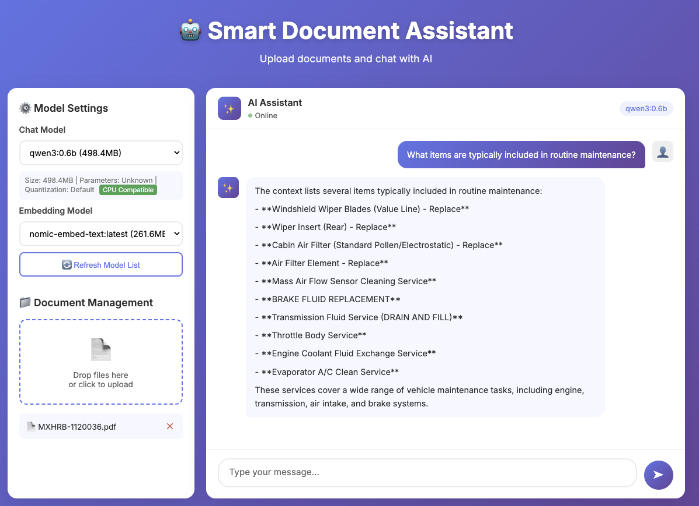

# Smart Document Assistant

A document chat system built with LlamaIndex + Ollama, featuring a clean layered architecture and support for multiple vector databases. Beautiful WebUI included.



## Features

- **Document Upload**: Support for PDF, TXT, DOC, DOCX, MD
- **Intelligent Q&A**: Context-aware answers based on document content
- **Model Selection**: Choose LLM and embedding models via WebUI
- **Multi-Vector Store Support**: Simple (in-memory), ChromaDB, and extensible to others (Pinecone, Qdrant, etc.)
- **Modular Architecture**: Clean separation of concerns with layered design
- **Persistent Storage**: Document and vector embeddings persist across restarts
- **GPU Acceleration**: External Ollama service for efficient inference

## Architecture

The project follows a layered architecture for maintainability and extensibility:

```
backend/
├── main.py                    # Application entry point
├── app/
│   ├── config.py              # Configuration management (Pydantic Settings)
│   ├── api/routes/            # API layer - HTTP endpoints
│   │   ├── chat.py            # Chat endpoints
│   │   ├── documents.py       # Document management
│   │   ├── models.py          # Model management
│   │   ├── health.py          # Health checks
│   │   └── frontend.py        # Static file serving
│   ├── core/                  # Core abstractions
│   │   ├── vector_store/      # Vector store abstraction
│   │   │   ├── base.py        # Abstract base + factory
│   │   │   ├── simple.py      # In-memory implementation
│   │   │   └── chroma.py      # ChromaDB implementation
│   │   └── llm/               # LLM abstraction
│   │       ├── base.py        # Abstract base + factory
│   │       └── ollama.py      # Ollama implementation
│   ├── models/                # Data models
│   │   └── schemas.py         # Pydantic schemas
│   ├── services/              # Business logic layer
│   │   ├── chat_service.py    # Chat & indexing logic
│   │   ├── document_service.py # File operations
│   │   └── model_service.py   # LLM management
│   └── utils/                 # Utilities
│       ├── security.py        # Security helpers
│       └── helpers.py         # General utilities
```

### System Architecture

```
┌─────────────────────────────────────────────────────────────┐
│                      Web Browser                            │
│                     (React HTML UI)                         │
└───────────────────────────┬─────────────────────────────────┘
                            │ HTTP API
                            ▼
┌─────────────────────────────────────────────────────────────┐
│                Doc-Chat Backend (FastAPI)                   │
│  ┌─────────────────────────────────────────────────────┐   │
│  │                 API Layer                           │   │
│  │  - Document Upload & Management                      │   │
│  │  - Chat API                                         │   │
│  │  - Model Selection                                  │   │
│  └─────────────────────────────────────────────────────┘   │
│  ┌─────────────────────────────────────────────────────┐   │
│  │              Services Layer                         │   │
│  │  - ChatService: Conversation & indexing logic       │   │
│  │  - DocumentService: File operations                 │   │
│  │  - ModelService: LLM provider management            │   │
│  └─────────────────────────────────────────────────────┘   │
│  ┌─────────────────────────────────────────────────────┐   │
│  │              Core Abstractions Layer                │   │
│  │  ┌───────────────┐    ┌─────────────────────────┐  │   │
│  │  │ Vector Store  │    │ LLM Provider            │  │   │
│  │  │  (Abstract)   │    │ (Abstract)              │  │   │
│  │  │  - Simple     │    │  - Ollama               │  │   │
│  │  │  - Chroma     │    │  - (Extensible)         │  │   │
│  │  │  - (Add more) │    │                         │  │   │
│  │  └───────────────┘    └─────────────────────────┘  │   │
│  └─────────────────────────────────────────────────────┘   │
│                            │                                │
│          ┌─────────────────┴─────────────────┐             │
│          ▼                                   ▼             │
│  ┌─────────────────────┐    ┌───────────────────────┐     │
│  │   External Ollama   │    │    Vector Store       │     │
│  │   10.0.0.55:11434   │    │  (Simple/Chroma/etc)  │     │
│  └─────────────────────┘    └───────────────────────┘     │
└─────────────────────────────────────────────────────────────┘
```

## Prerequisites

- Python 3.8+ or Kubernetes cluster
- External Ollama service (e.g., http://10.0.0.55:11434)
- (Optional) ChromaDB server for persistent vector storage
- (Optional) Configured Ingress Controller for K8s deployment

## Quick Start (Local Development)

### 1. Install Dependencies

```bash
cd backend
pip install -r requirements.txt
```

### 2. Configure Environment

```bash
# Create .env file or export variables
export OLLAMA_BASE_URL=http://10.0.0.55:11434
export MODEL_NAME=llama3.2
export EMBEDDING_MODEL=nomic-embed-text
export VECTOR_STORE_TYPE=simple  # or 'chroma' for persistent storage
```

### 3. Run the Application

```bash
python main.py
# Or with uvicorn directly:
uvicorn main:app --reload --host 0.0.0.0 --port 8000
```

Visit http://localhost:8000 for the WebUI or http://localhost:8000/docs for API documentation.

## Kubernetes Deployment

### 1. Build Docker Image

```bash
docker build -t doc-chat:latest .
```

### 2. Push to Registry (Optional)

```bash
docker tag doc-chat:latest your-registry/doc-chat:latest
docker push your-registry/doc-chat:latest
```

### 3. Deploy to Kubernetes

```bash
kubectl apply -f deployment/deployment.yaml
```

### 4. Verify Deployment

```bash
kubectl get pods -n doc-chat-system -l app=doc-chat
kubectl get pods -n doc-chat-system -l app=chroma
kubectl get svc -n doc-chat-system doc-chat chroma
kubectl get ingress -n doc-chat-system doc-chat
```

## API Documentation

### Upload Document
```
POST /documents/upload
Content-Type: multipart/form-data

Parameters:
- file: File to upload (PDF, TXT, DOC, DOCX, MD)
```

### List Documents
```
GET /documents
```

### Chat
```
POST /chat
Content-Type: application/json

{
  "message": "Your question here",
  "conversation_id": "uuid-string (optional)",
  "model": "llama3.2 (optional)",
  "embedding_model": "nomic-embed-text (optional)"
}
```

### List Available Models
```
GET /models
```

### Get Recommended Models
```
GET /models/recommended
```

### Delete Document
```
DELETE /documents/{filename}
```

### Health Check
```
GET /health
```

## Configuration

### Environment Variables

| Variable | Description | Default |
|----------|-------------|---------|
| `OLLAMA_BASE_URL` | Ollama service URL | `http://10.0.0.55:11434` |
| `MODEL_NAME` | Default LLM model | `llama3.2` |
| `EMBEDDING_MODEL` | Default embedding model | `nomic-embed-text` |
| `VECTOR_STORE_TYPE` | Vector store type (`simple`, `chroma`) | `simple` |
| `USE_CHROMA` | Legacy: Enable Chroma (overrides VECTOR_STORE_TYPE if true) | `false` |
| `CHROMA_HOST` | Chroma server host | `chroma` |
| `CHROMA_PORT` | Chroma server port | `8000` |
| `CHROMA_COLLECTION` | Chroma collection name | `documents` |
| `UPLOAD_DIR` | Document upload directory | `uploads` |
| `CHROMA_DIR` | Chroma persistence directory | `chroma_db` |
| `STATIC_DIR` | Static files directory | `static` |
| `ALLOWED_ORIGINS` | CORS origins (comma-separated) | `` (empty = allow all) |
| `DEBUG` | Enable debug mode | `false` |

### Vector Store Selection

Choose your vector storage backend:

```bash
# In-memory (fast, non-persistent)
VECTOR_STORE_TYPE=simple

# ChromaDB (persistent, requires Chroma server)
VECTOR_STORE_TYPE=chroma
CHROMA_HOST=chroma
CHROMA_PORT=8000
```

## Extending the System

### Adding a New Vector Database

The architecture makes it easy to add new vector stores:

```python
# app/core/vector_store/pinecone.py
from app.core.vector_store.base import VectorStoreProvider, register_vector_store
from llama_index.vector_stores.pinecone import PineconeVectorStore

class PineconeVectorStoreProvider(VectorStoreProvider):
    def __init__(self, api_key: str, index_name: str):
        self.api_key = api_key
        self.index_name = index_name
    
    def get_vector_store(self):
        return PineconeVectorStore(api_key=self.api_key, index_name=self.index_name)
    
    def get_docstore(self):
        from llama_index.core.storage.docstore import SimpleDocumentStore
        return SimpleDocumentStore()
    
    def get_index_store(self):
        from llama_index.core.storage.index_store import SimpleIndexStore
        return SimpleIndexStore()
    
    def is_available(self) -> bool:
        # Check connectivity
        return True

# Register the provider
register_vector_store("pinecone", PineconeVectorStoreProvider)
```

Then configure:
```bash
VECTOR_STORE_TYPE=pinecone
PINECONE_API_KEY=your_key
PINECONE_INDEX_NAME=your_index
```

### Adding a New LLM Provider

```python
# app/core/llm/openai.py
from app.core.llm.base import LLMProvider, register_llm
from llama_index.llms.openai import OpenAI

class OpenAIProvider(LLMProvider):
    def __init__(self, api_key: str, default_model: str = "gpt-3.5-turbo"):
        self.api_key = api_key
        self.default_model = default_model
    
    def get_llm(self, model_name=None):
        return OpenAI(api_key=self.api_key, model=model_name or self.default_model)
    
    def get_embedding_model(self, model_name=None):
        from llama_index.embeddings.openai import OpenAIEmbedding
        return OpenAIEmbedding(api_key=self.api_key, model=model_name or "text-embedding-ada-002")
    
    def check_model_exists(self, model_name: str) -> bool:
        # Implementation
        return True
    
    def list_models(self) -> list[dict]:
        # Return available models
        return []

register_llm("openai", OpenAIProvider)
```

## Security Features

### CORS Protection
- Configurable via `ALLOWED_ORIGINS` environment variable
- Default allows all origins (`*`), production should restrict this

### File Upload Security
- Filename validation prevents path traversal attacks
- Files are validated to stay within the upload directory
- Invalid characters and `..` patterns are rejected

### Session Management
- Conversations auto-expire after 24 hours of inactivity
- Background thread cleans up expired sessions hourly
- Prevents memory leaks from stale sessions

## Development

### Project Structure

```
backend/
├── main.py              # Entry point, app factory
├── app/
│   ├── api/             # HTTP routes and handlers
│   ├── core/            # Business logic abstractions
│   ├── models/          # Data schemas
│   ├── services/        # Business logic implementation
│   └── utils/           # Helper functions
├── requirements.txt
└── ARCHITECTURE.md      # Detailed architecture guide
```

### Code Quality

All Python files pass syntax validation:
```bash
cd backend
python -m py_compile main.py app/**/*.py
```

## Troubleshooting

### Ollama Connection Issues
```bash
# Test Ollama connectivity
curl http://10.0.0.55:11434/api/tags
```

### Missing Models
```bash
# Pull required models
ollama pull llama3.2
ollama pull nomic-embed-text
```

### ChromaDB Connection Fails
- Falls back to simple in-memory storage automatically
- Check Chroma server status: `kubectl get pods -n doc-chat-system -l app=chroma`

## Requirements

- **Memory**: Minimum 2GB for the application, 512MB for Chroma
- **Storage**: 5GB PVC for uploads, 10GB PVC for Chroma vectors
- **Network**: Access to external Ollama service
- **Kubernetes**: Soft node affinity (prefers raspberrypi/ubuntu but works on any node)

## License

[Your License Here]

## Contributing

Contributions are welcome! Please ensure your code follows the existing architecture patterns and passes syntax checks.

---

**Note**: Uploaded files are persisted to PVC and survive Pod restarts. Vector embeddings are stored according to the configured vector store type.
